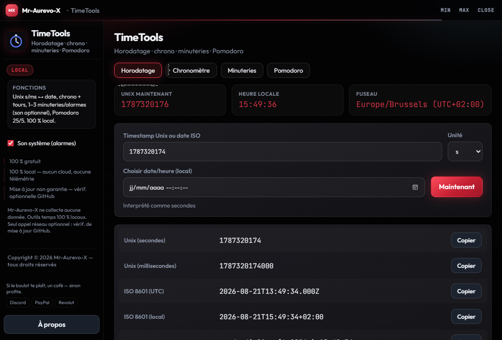

# TimeTools

**[Download TimeTools.exe](https://github.com/Mr-Aurevo-X/TimeTools/releases/latest/download/TimeTools.exe)** · **[All releases](https://github.com/Mr-Aurevo-X/TimeTools/releases)**

> Direct Windows binary (latest). Open [Releases](https://github.com/Mr-Aurevo-X/TimeTools/releases) if the right-sidebar "Releases" link is scrolled away — downloads are **not** under "Tags".

**© 2026 Mr-Aurevo-X — TimeTools — 100% local — free — updates not guaranteed**

Suite temps unifiée : horodatage Unix, chronomètre, minuteries et Pomodoro — 100 % local, 100 % gratuit.  
Unified time suite: Unix timestamps, stopwatch, timers and Pomodoro — 100% local, 100% free.

Fusion de **EpochClock** + **StopwatchPlus** en une seule app vitrine.


## Capture d'écran / Screenshot



## Download / Téléchargement

- **One-click:** [TimeTools.exe](https://github.com/Mr-Aurevo-X/TimeTools/releases/latest/download/TimeTools.exe)
- **Release notes / all versions:** [github.com/Mr-Aurevo-X/TimeTools/releases](https://github.com/Mr-Aurevo-X/TimeTools/releases)

Double-cliquer sur `TimeTools.exe` pour lancer (pas d'installation).  
Double-click `TimeTools.exe` to run (no install).

Windows peut afficher « potentiellement dangereux » : les binaires ne sont pas signés Authenticode (pas de certificat éditeur payant). C’est un avertissement de réputation SmartScreen, pas un verdict antivirus.  
Windows may flag the app as potentially unsafe: binaries are not Authenticode-signed (no paid publisher certificate). That is a SmartScreen reputation warning, not an antivirus verdict.

## Fonctions / Features (v1.0.0)

| Onglet / Tab | Contenu / Content |
|:--|:--|
| **Horodatage** | Unix (s/ms) ↔ date locale/UTC, temps relatif, fuseau, copie timestamp / ISO |
| **Chronomètre** | Stopwatch + tours (laps) |
| **Minuteries** | 1–3 minuteries / alarmes (son optionnel) |
| **Pomodoro** | Cycles travail/pause configurables (défaut 25/5) |

- Horloge live (Unix + heure locale + fuseau) sur l'onglet Horodatage
- **100 % local** — aucune conversion en ligne, aucune télémétrie
- Son système optionnel pour minuteries et Pomodoro

## Legal / Légal

| FR | EN |
|:--|:--|
| **100 % gratuit** | **100% free** |
| **100 % local** — aucun cloud, aucune télémétrie | **100% local** — no cloud, no telemetry |
| **Mise à jour non garantie** | **Updates not guaranteed** |
| **Copyright © 2026 Mr-Aurevo-X** — tous droits réservés | **Copyright © 2026 Mr-Aurevo-X** — all rights reserved |

Licence : **proprietary / all rights reserved** (voir `LICENSE`).

## Lancer / Build

| Fichier | Usage |
|:--|:--|
| `TimeTools.exe` | **Principal** — binaire windowed (après `Build.cmd`) |
| `Lancer.cmd` | exe si présent, sinon fallback `pythonw` détaché |

```powershell
cd "C:\Users\aurel\Documents\Dev Central Tree\Git Vitrine Public\TimeTools"
.\Build.cmd
```

Produit `dist\TimeTools.exe` puis copie vers `TimeTools.exe`.  
Pour publier une màj : bumper `VERSION`, build, créer une **GitHub Release** avec l'asset `TimeTools.exe`.

## UI kit

Chrome propriétaire : SoT `Dev Central Tree\02_Shared_Infrastructure\UI-proprietaire\` → `ui\vendor\pc-command-kit`  
Sync : `Build.cmd` ou `.\scripts\Sync-All-UiKit.ps1` (**ne pas** éditer le vendor à la main).

## Stack

Python · pywebview · PyInstaller · PC Command kit

## Soutien / Support

Coups de pouce volontaires · optional tips (app remains free) :

[](https://www.paypal.com/paypalme/aurevo1)
[](https://revolut.me/mr_aurevo_x)
---

Rêvée par **Mr-Aurevo-X**. Cursor a réalisé le rêve.

[Discord](https://discord.com/users/406891052516114442) · [PayPal](https://www.paypal.com/paypalme/aurevo1) · [Revolut](https://revolut.me/mr_aurevo_x)
